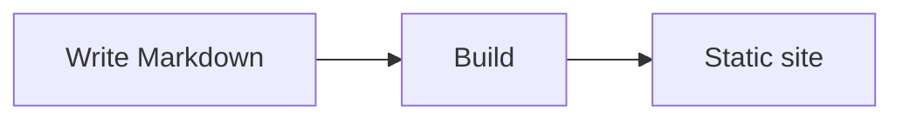

# Getting started

This folder is a **section**: it appears in the navbar because `docs/guide/`
exists, and its label comes from `_section.json` beside this file. Add another
folder and you get another section — there is no navigation to configure.

## Front matter

Every page starts with front matter. Only `title` really matters:

```yaml
---
title: Getting started
description: Shown in search results and link previews.
sidebar_position: 1
---
```

## Writing

Markdown works as you expect, plus a few extras:

:::tip
Admonitions come in `note`, `info`, `tip`, `success`, `warning`, `caution` and
`danger`.
:::

Code blocks are highlighted at build time, so they cost no JavaScript:

```ts title="src/example.ts"
export function greet(name: string): string {
  return `Hello, ${name}`;
}
```

## Components

Angular components work inside Markdown:

<fd-steps>
  <div step="Write a page">

Add a Markdown file under `docs/`.

  </div>
  <div step="Preview it">

`npm start`, then open the page.

  </div>
  <div step="Publish">

Commit and push — your host builds the site.

  </div>
</fd-steps>

## Diagrams

Fenced `mermaid` blocks render as diagrams:



## Where to read more

This starter is deliberately small. Every feature — components, theming, search,
the content manager, changelogs, deployment — is documented at
[feastdocs.feast-labs.com](https://feastdocs.feast-labs.com).
